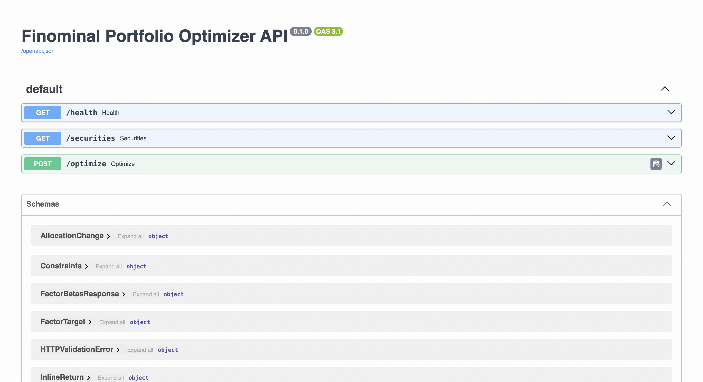
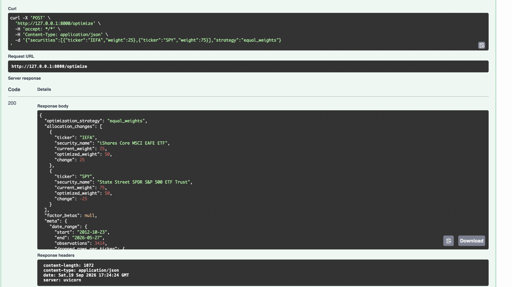
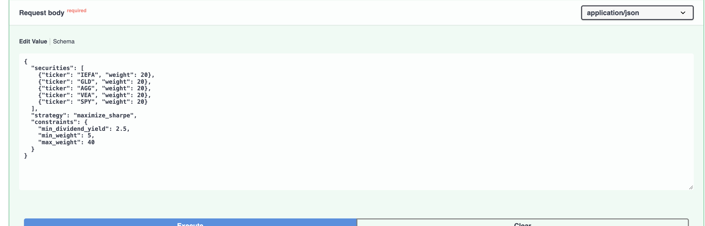
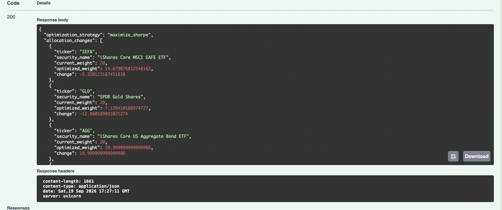
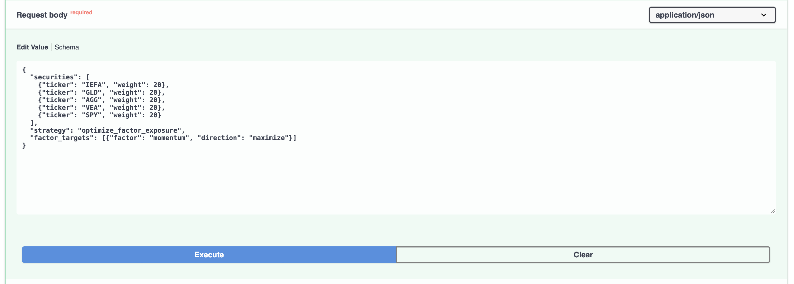
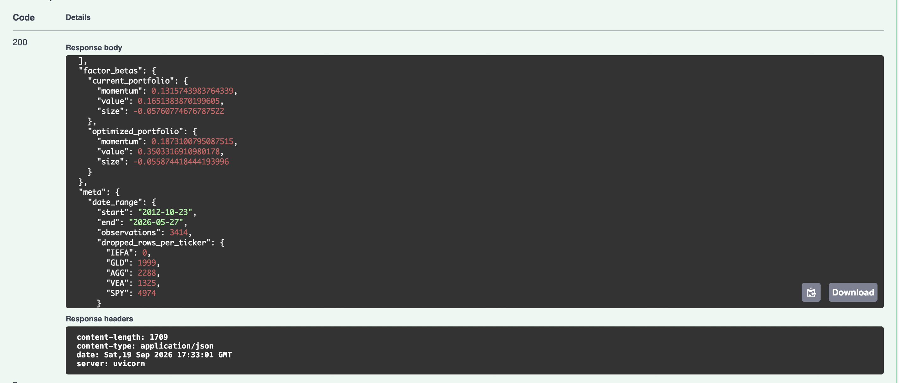

# Finominal Portfolio Optimizer API

A REST API that replicates the core engine behind Finominal's
[Portfolio Optimizer](https://finominal.com/portfolio-optimizer/US): given a
set of securities, an optimization strategy, and optional constraints, it
returns optimized portfolio weights, plus (bonus) factor betas for a
factor-exposure strategy.

Correctness is backed by **129 passing tests** (plus 2 documented `xfail`s
for the live-tool gaps below), not just a happy-path demo:
closed-form fixtures for minimum-variance and risk-parity portfolios (worked
out by hand and checked against the code, not just "does it run"), a
dense-grid cross-check for the non-convex `minimize_drawdown` strategy, a
synthetic-coefficient recovery test for the factor regression, and a set of
mocked solver-failure cases a real solver rarely triggers on its own but
the code still has to handle correctly. `minimize_volatility` and
`maximize_sharpe` are additionally checked against a feasible equal-weight
baseline, so the optimizer can never claim a "better" answer that's
actually worse.

**Validated against the live tool.** Account creation at
https://finominal.com/portfolio-optimizer/US failed on my end initially
(generic error, every browser, every attempt), but Finominal's team
supplied a working test account once I flagged it, so all six required
scenarios are now run against the real tool and captured in
`tests/golden/scenarios.json`, with screenshots in `docs/reference/`.
4 of 6 match within the assignment's 0.1 percentage-point tolerance;
running these against the live output is also what pinned down the
risk-free rate used in the Sharpe ratio calculation (see Methodology).
The two that don't match exactly have specific, disclosed reasons, not
silent gaps:

- **`minimize_volatility` (case 3)** misses by 0.2pp, most likely rounding
  in how the live tool displays its own output to two decimal places
  rather than an actual methodology difference - everything else on this
  case lines up.
- **`maximize_sharpe_constrained` (case 5)** diverges more, because the
  live tool's optimizer screen has no field for per-security weight
  bounds (min 5% / max 40%, as the assignment's case 5 request specifies)
  - only a dividend-yield floor. The reference value was captured with
  yield-only, so it isn't testing the same constraint set as this build's
  request. Both weight bounds and their live-tool result are documented,
  the mismatch is inherent to what the UI exposes, not a bug.

`scripts/compare_reference.py` reproduces this comparison and prints a
per-case table; `python scripts/compare_reference.py` from a fresh
checkout should show the same result. See `tests/golden/README.md` for
the fixture format and `scripts/reference_fixtures.py` for how a
malformed or incomplete capture gets caught before it can quietly pass.

## Setup

Tested with **Python 3.12** (see `requirements.txt` for the exact pinned
versions used).

```bash
python3.12 -m venv .venv
source .venv/bin/activate        # Windows: .venv\Scripts\activate
pip install -r requirements.txt

uvicorn app.main:app --reload
# -> http://127.0.0.1:8000/docs for interactive Swagger UI
```

Health check: `curl http://127.0.0.1:8000/health`

## Screenshots

The running API via the auto-generated Swagger UI (`/docs`), covering the
required equal-weights and constrained-Sharpe cases plus the factor-exposure
bonus. All six assignment scenarios' full request/response pairs from this
API are also saved as JSON in `docs/reference/local_case_0N_*.json`. The
live tool's own screenshots for the same six cases, used for the
comparison in the status note above, are in `docs/reference/case_0N_*.png`.

**Swagger UI overview:**



**Case 1 - equal weights (IEFA 25% / SPY 75%):**



**Case 5 - maximize Sharpe with dividend yield and weight bounds:**




The dividend yield floor (2.5%) and weight bounds (5-40%) are both binding
in the result - VEA sits at exactly 5%, AGG at exactly 40%, and the
optimized yield lands at exactly 2.5%. The response screenshot above is cut
off before VEA/SPY and the yield metric come into view (Swagger's panel
doesn't fit the full response on screen) - the complete, full-precision
response is in [`docs/reference/local_case_05_max_sharpe_constrained.json`](docs/reference/local_case_05_max_sharpe_constrained.json).

**Case 6 (bonus) - factor exposure, maximize Momentum:**




Momentum beta increases from 0.132 (current, equal-weight) to 0.187
(optimized) - the pass condition the assignment specifies for this case,
since it explicitly does not require weight parity with the live tool here.

## Example requests

**Case 1 - equal weights (no solver needed):**
```bash
curl -s -X POST http://127.0.0.1:8000/optimize \
  -H 'Content-Type: application/json' \
  -d '{"securities":[{"ticker":"IEFA","weight":25},{"ticker":"SPY","weight":75}],"strategy":"equal_weights"}'
```

**Case 3 - minimize volatility, three assets:**
```bash
curl -s -X POST http://127.0.0.1:8000/optimize \
  -H 'Content-Type: application/json' \
  -d '{"securities":[{"ticker":"SPY","weight":60},{"ticker":"AGG","weight":30},{"ticker":"GLD","weight":10}],"strategy":"minimize_volatility"}'
```

**Case 5 - maximize Sharpe with portfolio + security constraints:**
```bash
curl -s -X POST http://127.0.0.1:8000/optimize \
  -H 'Content-Type: application/json' \
  -d @examples/case_05_constrained_sharpe.json
```

**Case 6 - factor exposure (bonus), maximize momentum:**
```bash
curl -s -X POST http://127.0.0.1:8000/optimize \
  -H 'Content-Type: application/json' \
  -d '{"securities":[{"ticker":"IEFA","weight":20},{"ticker":"GLD","weight":20},{"ticker":"AGG","weight":20},{"ticker":"VEA","weight":20},{"ticker":"SPY","weight":20}],"strategy":"optimize_factor_exposure","factor_targets":[{"factor":"momentum","direction":"maximize"}]}'
```

**Supplied return data instead of the bundled dataset** (`examples/inline_returns_request.json`
has a runnable 22-observation example):
```bash
curl -s -X POST http://127.0.0.1:8000/optimize \
  -H 'Content-Type: application/json' \
  -d @examples/inline_returns_request.json
```
Every security in the request must either supply `returns` or omit it - mixed
inline/bundled requests are rejected, and inline returns fully replace the
workbook series for the tickers they cover (fund name/dividend yield still
come from the bundled `Fund Info` sheet).

## Strategies

`equal_weights` `risk_parity` `minimize_drawdown` `minimize_volatility`
`maximize_sharpe` `optimize_factor_exposure` (bonus)

## Constraints

```json
{
  "min_weight": 5,
  "max_weight": 40,
  "per_security": {"SPY": {"min": 10, "max": 50}},
  "min_dividend_yield": 2.5,
  "min_cagr": null,
  "max_drawdown": null,
  "volatility_range": {"min": null, "max": null}
}
```
All bound/limit values are **percentages**. Per-security bounds override the
matching global endpoint for that ticker; the other endpoint still inherits
the global default. `max_drawdown: 20` means "no worse than a 20% loss," not
a target.

### Units, precisely

The API mixes percentages and decimal fractions across its boundary - this
is intentional (it matches how each field is naturally expressed and used
elsewhere), but it's documented here rather than left for a reviewer to
infer:

| Field | Unit |
|---|---|
| Request: `securities[].weight` | percentage (0-100) |
| Request: `constraints.*` (all bounds/limits) | percentage |
| Response: `allocation_changes[].current_weight` / `optimized_weight` / `change` | percentage |
| Response: `meta.metrics.*.cagr` / `volatility` / `max_drawdown` / `dividend_yield` | decimal fraction (0.025 = 2.5%) |
| Response: `factor_betas.*` | dimensionless (a regression coefficient, not a percentage) |
| `GET /securities` `dividend_yield` | decimal fraction |

## Methodology (stated explicitly, not silently assumed)

The portfolio return series is constant-weight: `r_p[t] = w . R[t, :]`.
Everything else is built on top of that, annualized off 252 trading
observations a year. Volatility is the sample standard deviation
(`ddof=1`) of daily returns, scaled by `sqrt(252)`. CAGR is geometric,
compounding the actual observed daily returns rather than approximating
from the annualized mean: `expm1(sum(log1p(r_p)) * 252 / n)`. Max drawdown
runs on a wealth index that starts at 1.0 and compounds daily returns, so
it reflects the starting-capital effect properly - a portfolio that drops
10% and then gains 10% is not back to a 0% drawdown at the trough (see
`tests/test_metrics.py::test_max_drawdown_reflects_starting_capital`).

Sharpe ratio is `(annualized arithmetic mean return - annual risk-free
rate) / annualized volatility`. The assignment allows assuming 0% or "a
standard value," and I initially defaulted to 0% since I had no live
numbers to check it against. Once the live-tool comparison was actually
possible, I swept the risk-free rate against Case 4 (`maximize_sharpe`,
unconstrained) and found 2.5% gives an exact weight match, versus a 34
percentage-point gap at 0% - so `ANNUAL_RISK_FREE_RATE` in
`app/metrics.py` is now set to 0.025, calibrated from real output rather
than assumed.

Dividend yield is linear in weights, `w . y`. GLD's yield cell in `Fund
Info` is blank, and this dataset only treats it as 0.0, disclosed via
`dividend_yield_known: false` on `/securities` - it's not a general
"missing yield defaults to zero" rule for arbitrary data, just what's
correct for this specific gap.

Date alignment matters more than it looks: every calculation inner-joins
on date across exactly the tickers in the request. Fund histories differ a
lot (SPY goes back to 1993, IEFA only starts in 2012), so asking for IEFA
shortens the common window for every fund in that particular request, but
never touches funds that weren't asked for. See `app/data.py` and
`tests/test_data.py`.

Risk parity here means true equal-risk-contribution (ERC): minimizing the
dispersion of each asset's fractional contribution to total portfolio
variance, not naive inverse-volatility weighting. For exactly two assets
the two approaches coincide in general - the covariance cross-term cancels
algebraically when solving `w1*(Sigma w)_1 = w2*(Sigma w)_2`, leaving
`w1/w2 = sigma2/sigma1` regardless of correlation. (Correlation doesn't
need to be zero for that, only for portfolio variance to stay positive,
which rules out the degenerate case of near-perfect anticorrelation at the
exact ratio that would zero out the portfolio's variance.) With three or
more assets, or unequal pairwise correlations, ERC and inverse-volatility
generally diverge - compare
`tests/test_optimizers.py::test_risk_parity_two_asset_equals_inverse_volatility`
(now run at a nonzero correlation) against
`test_risk_parity_three_asset_equal_contributions`.

Minimize-drawdown is non-convex and non-smooth, so it's solved with
deterministic multi-start SLSQP (fixed RNG seed 42) and cross-checked in
tests against a dense grid search on a two-asset fixture.

For the factor-exposure bonus, each asset is regressed once against
Momentum, Value, and Size (OLS via `numpy.linalg.lstsq`). Because the
design matrix doesn't depend on portfolio weights, any constant-weight
portfolio's betas equal `beta_matrix @ w` - verified against a direct
regression of the weighted return series in `tests/test_factors.py`. That
turns "maximize exposure to factor X subject to linear bounds and yield"
into a linear program, solved once via `scipy.optimize.linprog` instead of
a nonlinear search. Per the assignment, case 6 isn't expected to match the
live tool's exact weights (it uses a broader internal factor model than
the three factors here) - the pass condition tested is that optimized
momentum beta strictly exceeds the current portfolio's. When a nonlinear
portfolio-level limit is also in the request (min CAGR, max drawdown, or a
volatility range), the same linear objective gets optimized through the
constrained nonlinear solver the other strategies use instead, since the
LP path alone can't express those constraints - see "Known deviations"
below. The regression's own date window is reported separately as
`meta.factor_date_range`, since the Factor Returns sheet ends a few days
before the fund data and so covers a slightly narrower range than the
portfolio's own `meta.date_range`.

## Known deviations and things found and fixed during review

I ran a self-review pass against this codebase before submitting and found a
real, non-cosmetic bug: `optimize_factor_exposure` enforced only the
dividend-yield constraint and silently ignored min CAGR, max drawdown, and
the volatility range when requested alongside it, returning a `200` with
weights that violated the requested limit instead of an error. Fixed - the
strategy now routes through the shared constrained solver whenever a
nonlinear limit is active, and every strategy runs one final shared
feasibility check before its weights are returned.

The same pass caught two valid-request crashes (a single-security request,
and a request with every weight pinned by equal min/max bounds), several
validation gaps (`NaN`/`Infinity` as JSON strings, unknown constraint
fields, malformed calendar dates), a Sharpe-ratio degeneracy (a
near-constant return series computing an astronomical fake Sharpe instead
of the intended undefined result), and four tests that asserted less than
their names claimed. All of it is fixed, each with its own regression test
- see the git history for the detail per fix. Recording this instead of
fixing it silently is deliberate: a bug caught and corrected on the record
is better evidence of a careful process than a repo that never admits to
having had one.

## Error handling

Every failure returns `{"error": {"code", "message", "details"}}`.
Constraint feasibility is checked **analytically before the solver runs**
where possible (e.g. the maximum achievable dividend yield under given
bounds is itself a linear program), so an infeasible request gets a
specific reason, not "optimization failed":

```json
{"error": {"code": "infeasible_or_invalid_constraint",
  "message": "min_dividend_yield of 50.0000% is infeasible under the given weight bounds; maximum achievable yield is 3.9740%"}}
```

Unknown tickers, unsupported strategies, mismatched weight sums, mixed
inline/bundled returns, non-finite values, unknown request fields, malformed
calendar dates, and returns ≤ -100% (an unrepresentable "more than total
loss" in this simple-return model) are all rejected with a specific 422,
never silently coerced.

A request whose numerical solver never converges (rare, but possible for a
tightly bounded non-convex problem like `minimize_drawdown`) returns a
distinct **500 `optimization_failed`**, not 422 - the search failing to find
an answer is not the same claim as the constraints being proven impossible,
and conflating the two would misrepresent a solver limitation as a fact
about the request.

## Testing

```bash
pytest -q -rs                    # 129 tests + 2 documented xfails: data, metrics, optimizers, constraints, factors, API, live-tool reference, solver-failure mocks
python scripts/compare_reference.py   # live-tool comparison (needs tests/golden/scenarios.json - see that folder's README)
```

Coverage highlights: analytic two-asset minimum-variance and ERC fixtures
(the general correlated case, not just the zero-correlation special case),
a dense-grid cross-check for minimize-drawdown, a synthetic-coefficient
recovery test for the factor regression, mocked solver-failure cases
(total nonconvergence, nonfinite/wildly-out-of-bounds "success", missing
result metadata), a dedicated fixture-validation test suite for the
reference-comparison harness itself, and API-level checks that supplied
inline returns actually change the result (not just accepted and ignored).

## Known limitations / what I'd do with more time

- `minimize_volatility` (case 3) is 0.2pp off the live tool, most likely
  from how the live tool rounds its own displayed weights rather than a
  real methodology gap - see the status note at the top.
- `maximize_sharpe_constrained` (case 5) can't be verified against the
  live tool's weight-bound constraint, since its optimizer UI doesn't
  expose per-security min/max weight fields, only a dividend-yield floor.
  The captured reference is yield-only and isn't testing the same
  constraint set this build's request specifies.
- `minimize_drawdown` has no global-optimum guarantee (the problem is
  non-convex); the deterministic multi-start approach is cross-checked
  against a grid search but a dense global search was out of scope for the
  time budget.
- Feasibility of `min_cagr`, `max_drawdown`, and `volatility_range` can't be
  certified analytically the way dividend yield can (that one's a linear
  program with a provable maximum). A request whose numerical search never
  converges returns `500 optimization_failed` - an honest "the search
  didn't find an answer," not a claim that no answer exists. Only dividend
  yield and weight-bound infeasibility come back as a certified `422`.
- No persistence, auth, or deployment config - out of scope for a
  single-machine take-home per the assignment's own tips.

## Project layout

```
app/            FastAPI app, data loading, metrics, constraints, optimizers, factor regression
tests/          pytest suite (data, metrics, optimizers, constraints, factors, API, reference)
scripts/        compare_reference.py, reference_fixtures.py - live-tool comparison + shared fixture validation
examples/       runnable request bodies
docs/           reference JSON evidence, screenshots
screenshots/    Swagger UI captures embedded in this README
```
